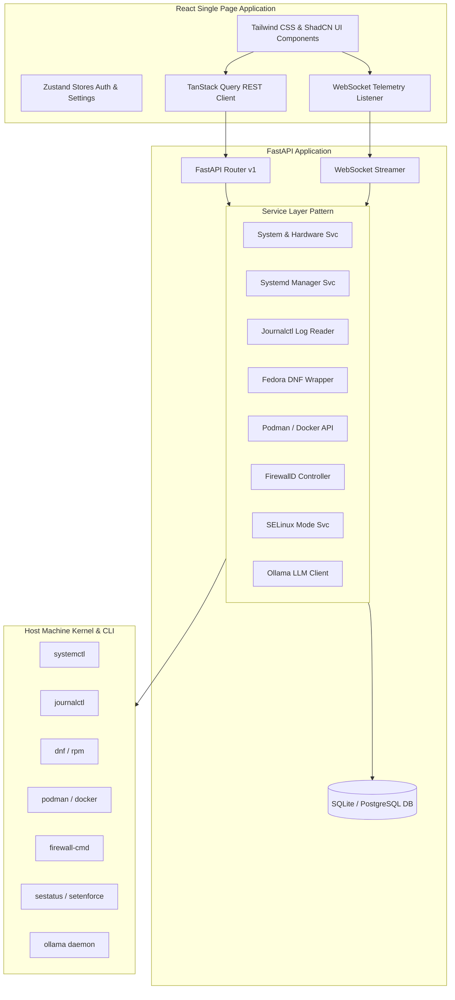

# Fedora Control Center

Fedora Control Center is a modern, high-fidelity web-based administration dashboard specifically designed for Fedora Workstation and Fedora Server. It provides an intuitive interface for system administrators to monitor, manage, and secure Fedora machines.

## Architecture Overview



## Features

1. **Auth & Security**: Role-based access control (Admin/Viewer), JWT tokens, and detailed database Audit Logs tracking every system modification.
2. **Dashboard**: Real-time telemetry (CPU usage & temperatures, RAM & Swap utilization, Disks I/O, Network statistics, and GPU load).
3. **Services**: Full systemd management (start, stop, restart, enable status).
4. **Logs**: Live scrollable Journalctl viewer with search, priority, and date filters, and log exports.
5. **Updates**: Full Fedora DNF package manager integration (check updates, install upgrades, package search, and rpm history).
6. **Hardware**: Core sensors, motherboard info, fan RPM speeds, battery charge, and disk SMART health.
7. **Containers**: Podman & Docker containers listener, controls, and tail log viewer.
8. **Firewall**: FirewallD zones lookup, active rule settings, allowed services, and open/close ports.
9. **SELinux**: Status viewer and live toggle between Enforcing and Permissive modes.
10. **AI Module**: Local Ollama LLM integration to pull models and run prompt templates.
11. **Network**: Interface bandwidth tracking, active sockets list, kernel routing table inspection, Wi-Fi scanning, and `firewall-cmd` MAC-based device blocking with domain connection logs persistence.

## Quick Start (Local Development)

Clone the repository and run:

```bash
# Set up backend virtualenv and install dependencies
make install-backend

# Start FastAPI backend server (port 8000)
make run-backend

# Install frontend dependencies and start Vite dev server (port 5173)
make install-frontend
make run-frontend
```

Open `http://localhost:5173` in your browser.
**Default Credentials:**
- **Username**: `admin`
- **Password**: `fedora`
